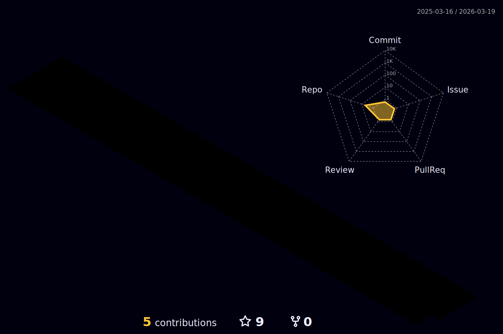

 
<!-- height gif 250 image 400 -->

- 🔭 𝙸’𝚖 𝚌𝚞𝚛𝚛𝚎𝚗𝚝𝚕𝚢 𝚠𝚘𝚛𝚔𝚒𝚗𝚐 𝚘𝚗 **Data Science 𝚊𝚗𝚍 𝚆𝚎𝚋 𝙳𝚎𝚟𝚎𝚕𝚘𝚙𝚖𝚎𝚗𝚝.**
- 🌱 𝙸’𝚖 𝚌𝚞𝚛𝚛𝚎𝚗𝚝𝚕𝚢 𝚕𝚎𝚊𝚛𝚗𝚒𝚗𝚐 **𝙳𝚎𝚟𝙾𝚙𝚜 𝚊𝚗𝚍 𝙲𝚘𝚖𝚙𝚎𝚝𝚒𝚝𝚒𝚟𝚎 𝙿𝚛𝚘𝚐𝚛𝚊𝚖𝚖𝚒𝚗𝚐.**
- 👯 𝙸’𝚖 𝚕𝚘𝚘𝚔𝚒𝚗𝚐 𝚝𝚘 𝚌𝚘𝚕𝚕𝚊𝚋𝚘𝚛𝚊𝚝𝚎 𝚘𝚗 **𝙰𝚗𝚍𝚛𝚘𝚒𝚍, 𝙳𝚊𝚝𝚊 𝚂𝚌𝚒𝚎𝚗𝚌𝚎 𝚘𝚛 𝚆𝚎𝚋 𝙳𝚎𝚟𝚎𝚕𝚘𝚙𝚖𝚎𝚗𝚝.**
- 💬 𝙰𝚜𝚔 𝙼𝚎 𝙰𝚋𝚘𝚞𝚝 𝙰𝚗𝚢𝚝𝚑𝚒𝚗𝚐 [here](https://github.com/madhavaprmr/madhavaprmr/issues/) ! 𝙸 𝚊𝚖 𝚑𝚊𝚙𝚙𝚢 𝚝𝚘 𝚑𝚎𝚕𝚙.
- ⚡ 𝙵𝚞𝚗 𝚏𝚊𝚌𝚝 : **Was wir wissen, ist ein Tropfen, was wir nicht wissen, ein Ozean.**

 
 
 

 

#

   •   
<!--    • -->
   •
   •
  

<!-- 

  <code>
    
  </code>

 -->

#

<h3 align="left">Connect with me:</h3>

<h3 align="left">Languages and Tools:</h3>

               

### &nbsp; 🖥️ Main Tech  

<table align="center">
    <tr>
        <td align="center" width="96">
            
             AI
        </td>
        <td align="center" width="96">
            
             Python
        </td>
        <td align="center" width="96">
            
             FastAPI
        </td>
        <td align="center" width="96">
            
             Django
        </td>
        <td align="center" width="96">
            
             Flask
        </td>
        <td align="center" width="96">
            
             NodeJS
        </td>
        <td align="center" width="96">
            
             Express
        </td>
        <td align="center" width="96">
            
             PHP
        </td>
        <td align="center" width="96">
            
             Laravel
        </td>
    </tr>
    <tr>
        <td align="center" width="96">
            
             JavaScript
        </td>
        <td align="center" width="96">
            
             TypeScript
        </td>
        <td align="center" width="96">
            
             React
        </td>
        <td align="center" width="96">
            
             Redux
        </td>
        <td align="center" width="96">
            
             NextJS
        </td>
        <td align="center" width="96">
            
             GraphQL
        </td>
        <td align="center" width="96">
            
             Sass
        </td>
        <td align="center" width="96">
            
             Tailwind
        </td>
        <td align="center" width="96">
            
             Webpack
        </td>
    </tr>
    <tr>
        <td align="center" width="96">
            
             PostgreSQL
        </td>
        <td align="center" width="96">
            
             MySQL
        </td>
        <td align="center" width="96">
            
             MongoDB
        </td>
        <td align="center" width="96">
            
             Cassandra
        </td>
        <td align="center" width="96">
            
             ElasticSearch
        </td>
        <td align="center" width="96">
            
             Firebase
        </td>
        <td align="center" width="96">
            
             Supabase
        </td>
        <td align="center" width="96">
            
             RabbitMQ
        </td>
        <td align="center" width="96">
            
             Redis
        </td>
    </tr>
    <tr>
        <td align="center" width="96">
            
             Tensorflow
        </td>
        <td align="center" width="96">
            
             Pytorch
        </td>
        <td align="center" width="96">
            
             Selenium
        </td>
        <td align="center" width="96">
            
             Nginx
        </td>
        <td align="center" width="96">
            
             Docker
        </td>
        <td align="center" width="96">
            
             Kubernetes
        </td>
        <td align="center" width="96">
            
             AWS
        </td>
        <td align="center" width="96">
            
             Azure
        </td>
        <td align="center" width="96">
            
             GCP
        </td>
    </tr>
</table>

 

#

  
  
  

#

 

#

  <g-emoji class="g-emoji" alias="chart_with_upwards_trend" fallback-src="https://github.githubassets.com/images/icons/emoji/unicode/1f4c8.png">📈</g-emoji>
  <strong>𝙶𝚒𝚝𝚑𝚞𝚋 𝚂𝚝𝚊𝚝𝚜 : </strong>

 

    

 

<!-- Made with [OSS Insight](https://ossinsight.io/) -->
 

  

 

<!--START_SECTION:waka-->

<!--END_SECTION:waka-->

#

    
  <h4 align="center"><code>📊 𝙶𝚒𝚝𝙷𝚞𝚋 𝙼𝚎𝚝𝚛𝚒𝚌𝚜</code></h4>

  
  

 

#### 🗣 Languages

  
  
  
  

---

#### 𝚂𝚑𝚘𝚠 𝚜𝚘𝚖𝚎 ❤️ 𝚋𝚢 𝚜𝚝𝚊𝚛𝚛𝚒𝚗𝚐 𝚜𝚘𝚖𝚎 𝚘𝚏 𝚝𝚑𝚎 𝚛𝚎𝚙𝚘𝚜𝚒𝚝𝚘𝚛𝚒𝚎𝚜!

#

<!--

     

-->
