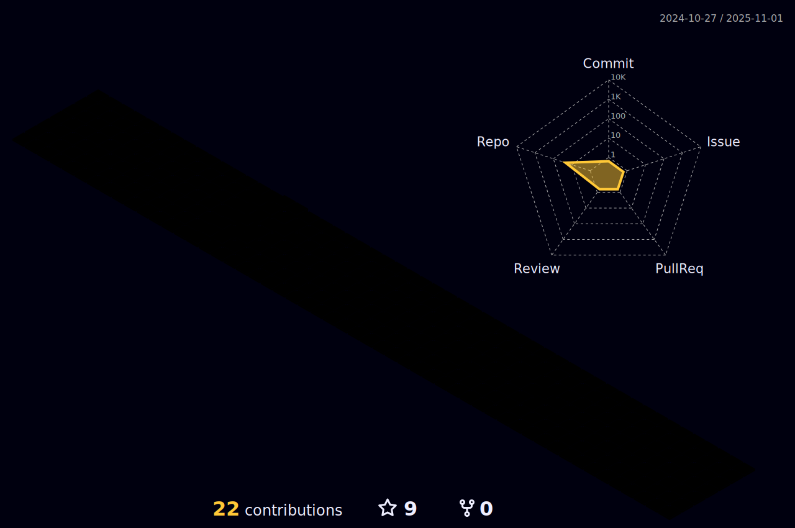

<br/>


- 🔭 𝙸’𝚖 𝚌𝚞𝚛𝚛𝚎𝚗𝚝𝚕𝚢 𝚠𝚘𝚛𝚔𝚒𝚗𝚐 𝚘𝚗 **Data Science 𝚊𝚗𝚍 𝚆𝚎𝚋 𝙳𝚎𝚟𝚎𝚕𝚘𝚙𝚖𝚎𝚗𝚝.**
- 🌱 𝙸’𝚖 𝚌𝚞𝚛𝚛𝚎𝚗𝚝𝚕𝚢 𝚕𝚎𝚊𝚛𝚗𝚒𝚗𝚐 **𝙳𝚎𝚟𝙾𝚙𝚜 𝚊𝚗𝚍 𝙲𝚘𝚖𝚙𝚎𝚝𝚒𝚝𝚒𝚟𝚎 𝙿𝚛𝚘𝚐𝚛𝚊𝚖𝚖𝚒𝚗𝚐.**
- 👯 𝙸’𝚖 𝚕𝚘𝚘𝚔𝚒𝚗𝚐 𝚝𝚘 𝚌𝚘𝚕𝚕𝚊𝚋𝚘𝚛𝚊𝚝𝚎 𝚘𝚗 **𝙰𝚗𝚍𝚛𝚘𝚒𝚍, 𝙳𝚊𝚝𝚊 𝚂𝚌𝚒𝚎𝚗𝚌𝚎 𝚘𝚛 𝚆𝚎𝚋 𝙳𝚎𝚟𝚎𝚕𝚘𝚙𝚖𝚎𝚗𝚝.**
- 💬 𝙰𝚜𝚔 𝙼𝚎 𝙰𝚋𝚘𝚞𝚝 𝙰𝚗𝚢𝚝𝚑𝚒𝚗𝚐 [here](https://github.com/madhavaprmr/madhavaprmr/issues/) ! 𝙸 𝚊𝚖 𝚑𝚊𝚙𝚙𝚢 𝚝𝚘 𝚑𝚎𝚕𝚙.
- ⚡ 𝙵𝚞𝚗 𝚏𝚊𝚌𝚝 : **𝙱𝚎𝚜𝚝 𝙿𝚊𝚛𝚝 𝙾𝚏 𝚃𝚑𝚎 𝙹𝚘𝚞𝚛𝚗𝚎𝚢 𝙸𝚜 : *𝙸𝚝 𝙴𝚗𝚍𝚜.***

<br/>
<br/>


<p align="center">
   •   
<!--   <a href="https://user-badge.committers.top/india_private/madhavaprmr"></a> • -->
   •
   •
  <a href="https://github.com/sponsors/madhavaprmr"></a>
</p>
<!-- <p align="center">
  <code>
    
  </code>
</p> -->

#

<!---->

<h3 align="left">Connect with me:</h3>
<p align="left">
<a href="https://linkedin.com/in/madhavaprmr" target="blank"></a>
<a href="https://instagram.com/madhavaparmar" target="blank"></a>
<a href="https://www.youtube.com/@visaeris7" target="blank"></a>
</p>

<h3 align="left">Languages and Tools:</h3>
<p align="left"> <a href="https://angular.io" target="_blank" rel="noreferrer">  </a> <a href="https://angular.io" target="_blank" rel="noreferrer">  </a> <a href="https://getbootstrap.com" target="_blank" rel="noreferrer">  </a> <a href="https://www.cprogramming.com/" target="_blank" rel="noreferrer">  </a> <a href="https://www.w3schools.com/cpp/" target="_blank" rel="noreferrer">  </a> <a href="https://www.w3schools.com/css/" target="_blank" rel="noreferrer">  </a> <a href="https://expressjs.com" target="_blank" rel="noreferrer">  </a> <a href="https://www.w3.org/html/" target="_blank" rel="noreferrer">  </a> <a href="https://www.java.com" target="_blank" rel="noreferrer">  </a> <a href="https://developer.mozilla.org/en-US/docs/Web/JavaScript" target="_blank" rel="noreferrer">  </a> <a href="https://nodejs.org" target="_blank" rel="noreferrer">  </a> <a href="https://www.python.org" target="_blank" rel="noreferrer">  </a> <a href="https://reactjs.org/" target="_blank" rel="noreferrer">  </a> <a href="https://unity.com/" target="_blank" rel="noreferrer">  </a> </p>

<hr/>

### &nbsp; 🖥️ Main Tech  

<table align="center">
    <tr>
        <td align="center" width="96">
            
            <br>AI
        </td>
        <td align="center" width="96">
            
            <br>Python
        </td>
        <td align="center" width="96">
            
            <br>FastAPI
        </td>
        <td align="center" width="96">
            <a href="#macropower-tech">
                
            </a>
            <br>Django
        </td>
        <td align="center" width="96">
            
            <br>Flask
        </td>
        <td align="center" width="96">
            
            <br>NodeJS
        </td>
        <td align="center" width="96">
            
            <br>Express
        </td>
        <td align="center" width="96">
            
            <br>PHP
        </td>
        <td align="center" width="96">
            
            <br>Laravel
        </td>
    </tr>
    <tr>
        <td align="center" width="96">
            
            <br>JavaScript
        </td>
        <td align="center" width="96">
            
            <br>TypeScript
        </td>
        <td align="center" width="96">
            
            <br>React
        </td>
        <td align="center" width="96">
            
            <br>Redux
        </td>
        <td align="center" width="96">
            
            <br>NextJS
        </td>
        <td align="center" width="96">
            
            <br>GraphQL
        </td>
        <td align="center" width="96">
            
            <br>Sass
        </td>
        <td align="center" width="96">
            
            <br>Tailwind
        </td>
        <td align="center" width="96">
            
            <br>Webpack
        </td>
    </tr>
    <tr>
        <td align="center" width="96">
            
            <br>PostgreSQL
        </td>
        <td align="center" width="96">
            
            <br>MySQL
        </td>
        <td align="center" width="96">
            
            <br>MongoDB
        </td>
        <td align="center" width="96">
            
            <br>Cassandra
        </td>
        <td align="center" width="96">
            
            <br>ElasticSearch
        </td>
        <td align="center" width="96">
            
            <br>Firebase
        </td>
        <td align="center" width="96">
            
            <br>Supabase
        </td>
        <td align="center" width="96">
            
            <br>RabbitMQ
        </td>
        <td align="center" width="96">
            
            <br>Redis
        </td>
    </tr>
    <tr>
        <td align="center" width="96">
            
            <br>Tensorflow
        </td>
        <td align="center" width="96">
            
            <br>Pytorch
        </td>
        <td align="center" width="96">
            
            <br>Selenium
        </td>
        <td align="center" width="96">
            
            <br>Nginx
        </td>
        <td align="center" width="96">
            
            <br>Docker
        </td>
        <td align="center" width="96">
            
            <br>Kubernetes
        </td>
        <td align="center" width="96">
            
            <br>AWS
        </td>
        <td align="center" width="96">
            
            <br>Azure
        </td>
        <td align="center" width="96">
            
            <br>GCP
        </td>
    </tr>
</table>

<br>
<hr/>

<p align="center">
  
  
  
</p>

#

<br/>

#

<details open="">
<summary>
  <g-emoji class="g-emoji" alias="chart_with_upwards_trend" fallback-src="https://github.githubassets.com/images/icons/emoji/unicode/1f4c8.png">📈</g-emoji>
  <strong>𝙶𝚒𝚝𝚑𝚞𝚋 𝚂𝚝𝚊𝚝𝚜 : </strong>
</summary>
<br/>

<p align="center">
    
    
</p>
</details>
<br/>




<h4 align="center">
  
```diff
+@ @ @ @ @ @ @ @ @ @ @ @ @ @ @ @ @ @ @ @ @ @ @ @ @ @ @ @+
@@       o o                                           @@
@@       | |                                           @@
@@      _L_L_                                          @@
@@   ❮\/__-__\/❯ Programming isn't about what you know @@
@@   ❮(|~o.o~|)❯  It's about what you can figure out   @@
@@   ❮/ \`-'/ \❯                                       @@
@@     _/`U'\_                                         @@
@@    ( .   . )     .----------------------------.     @@
@@   / /     \ \    | while( ! (succeed=try() ) ) |     @@
@@   \ |  ,  | /    '----------------------------'     @@
@@    \|=====|/                                        @@
@@     |_.^._|                                         @@
@@     | |"| |                                         @@
@@     ( ) ( )   Testing leads to failure              @@
@@     |_| |_|   and failure leads to understanding    @@
@@ _.-' _j L_ '-._                                     @@
@@(___.'     '.___)                                    @@
+@ @ @ @ @ @ @ @ @ @ @ @ @ @ @ @ @ @ @ @ @ @ @ @ @ @ @ @+
```

</h4>  
  


<br/>

#

<summary>
  <g-emoji class="g-emoji" alias="chart_with_upwards_trend" fallback-src="https://github.githubassets.com/images/icons/emoji/unicode/1f4c8.png">📈</g-emoji>
  <strong>𝚆𝚊𝚔𝚊𝚃𝚒𝚖𝚎 𝚂𝚝𝚊𝚝𝚜 : </strong>
</summary>


<br>
<br>

<!--START_SECTION:waka-->


**🐱 My GitHub Data** 

> 📦 14.2 MB Used in GitHub's Storage 
 > 
> 🏆 451 Contributions in the Year 2025
 > 
> 💼 Opted to Hire
 > 
> 📜 208 Public Repositories 
 > 
> 🔑 1 Private Repositories 
 > 
**I'm a Night 🦉** 

```text
🌞 Morning                17158 commits       █████░░░░░░░░░░░░░░░░░░░░   18.11 % 
🌆 Daytime                26315 commits       ███████░░░░░░░░░░░░░░░░░░   27.78 % 
🌃 Evening                33094 commits       █████████░░░░░░░░░░░░░░░░   34.93 % 
🌙 Night                  18164 commits       █████░░░░░░░░░░░░░░░░░░░░   19.17 % 
```
📅 **I'm Most Productive on Sunday** 

```text
Monday                   13206 commits       ███░░░░░░░░░░░░░░░░░░░░░░   13.94 % 
Tuesday                  13282 commits       ████░░░░░░░░░░░░░░░░░░░░░   14.02 % 
Wednesday                13416 commits       ████░░░░░░░░░░░░░░░░░░░░░   14.16 % 
Thursday                 13201 commits       ███░░░░░░░░░░░░░░░░░░░░░░   13.94 % 
Friday                   13249 commits       ███░░░░░░░░░░░░░░░░░░░░░░   13.99 % 
Saturday                 13797 commits       ████░░░░░░░░░░░░░░░░░░░░░   14.56 % 
Sunday                   14580 commits       ████░░░░░░░░░░░░░░░░░░░░░   15.39 % 
```


📊 **This Week I Spent My Time On** 

```text
🕑︎ Time Zone: Asia/Kolkata

💬 Programming Languages: 
Other                    22 hrs 20 mins      █████████████████████████   99.54 % 
Protocol Buffer          4 mins              ░░░░░░░░░░░░░░░░░░░░░░░░░   00.31 % 
Jupyter Notebook         1 min               ░░░░░░░░░░░░░░░░░░░░░░░░░   00.15 % 

🔥 Editors: 
Chrome                   22 hrs 26 mins      █████████████████████████   100.00 % 

🐱‍💻 Projects: 
JayantGoel001            15 hrs 12 mins      █████████████████░░░░░░░░   67.74 % 
mvw-dpex-rgs             7 hrs 12 mins       ████████░░░░░░░░░░░░░░░░░   32.08 % 
TerraBlue-XT             1 min               ░░░░░░░░░░░░░░░░░░░░░░░░░   00.08 % 
A-Social-Media           0 secs              ░░░░░░░░░░░░░░░░░░░░░░░░░   00.03 % 
A-to-Z-Resources-for-Stud0 secs              ░░░░░░░░░░░░░░░░░░░░░░░░░   00.03 % 

💻 Operating System: 
Windows                  19 hrs 53 mins      ██████████████████████░░░   88.58 % 
Mac                      2 hrs 33 mins       ███░░░░░░░░░░░░░░░░░░░░░░   11.42 % 
```

**I Mostly Code in Jupyter Notebook** 

```text
C++                      20 repos            ███░░░░░░░░░░░░░░░░░░░░░░   13.61 % 
JavaScript               12 repos            ██░░░░░░░░░░░░░░░░░░░░░░░   08.16 % 
Dockerfile               2 repos             ░░░░░░░░░░░░░░░░░░░░░░░░░   01.36 % 
TeX                      1 repo              ░░░░░░░░░░░░░░░░░░░░░░░░░   00.68 % 
R                        1 repo              ░░░░░░░░░░░░░░░░░░░░░░░░░   00.68 % 
```


 Last Updated on 12/02/2025 02:38:30 UTC
<!--END_SECTION:waka-->

<p align="center">
  
  
</p>

#

<p align="center">
    
  <h4 align="center"><code>📊 𝙶𝚒𝚝𝙷𝚞𝚋 𝙼𝚎𝚝𝚛𝚒𝚌𝚜</code></h4>
</p>

<p align="center">
  
  
</p>

<br/>

<div align="center">

## 🗣 Languages
<div>
  
  
  
  
</div>

---
[](https://visitcount.itsvg.in)

#### 𝚂𝚑𝚘𝚠 𝚜𝚘𝚖𝚎 ❤️ 𝚋𝚢 𝚜𝚝𝚊𝚛𝚛𝚒𝚗𝚐 𝚜𝚘𝚖𝚎 𝚘𝚏 𝚝𝚑𝚎 𝚛𝚎𝚙𝚘𝚜𝚒𝚝𝚘𝚛𝚒𝚎𝚜!

</div>

#

<!--  -->

<p align="center">
     
</p>
